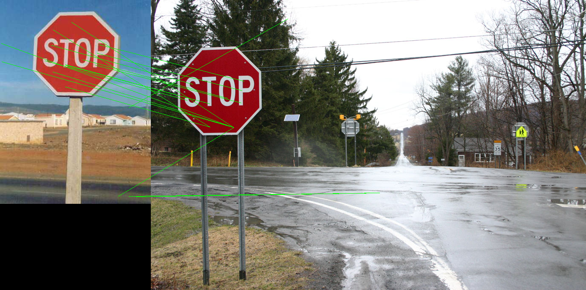
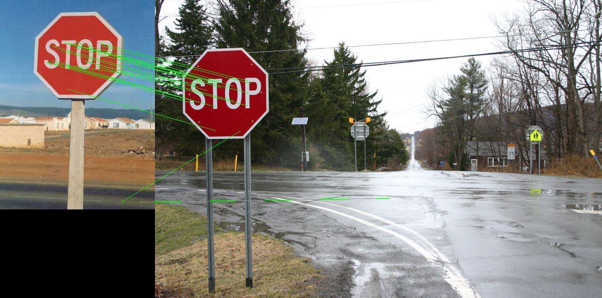

# Object-Instance-Recognition
Lowe-style object instance recognition, using SIFT. The scale-invariant feature transform (SIFT) is a computer vision algorithm to detect, describe, and match local features in images

## Overview
This problem explores the Lowe-style object instance recognition.

Implement the nearest neighbor distance ratio test using the pre-computed SIFT features SIFT_features.mat provided in the supplementary material. The Frame1, Frame2 indicate the 2D position, scales, and the orientation of the descriptors and Descriptor1, Descriptor2 are the correspondin 128-D SIFT features. Display the matches like this:


# Results

<br>


# Folder Structure
```
📦Object-Instance-Recognition
 ┣ 📂Results
 ┃ ┣ 📜output.png
 ┃ ┗ 📜output_2.png
 ┣ 📜.gitignore
 ┣ 📜LICENSE
 ┣ 📜Object_Instance_Recognition.ipynb
 ┗ 📜README.md
```